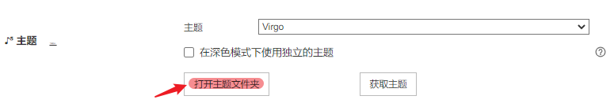

## 更新日志

```
- 2023-04-17 20:48 新增 Virgo Dark 暗色主题样式
```

## 简介

[🎨 Typora-Theme-Virgo](https://theme.typora.io/theme/Virgo/)

该主题对应于 Hugo 静态博客主题  [hugo-theme-virgo](https://github.com/loveminimal/hugo-theme-virgo) ，拥有 90%+ 的相似度（毕竟基本全套都是原主题样式 😄）。


## 使用

在 `偏好设置 / 外观` 中点击 `打开主题文件夹` ，如下：



该文件夹下存放着 Typora 的主题文件，在文件夹下，执行如下命令：

```
git clone https://github.com/loveminimal/typora-theme-virgo.git
```

然后，将文件夹 `typora-theme-virgo` 中的 `virgo` 文件夹和 `virgo.css` 、 `virgo-dark.css` 拷贝一份到当前目录下，重启 Typora ，即可选择主题 `Virgo` 、 `Virgo Dark` 。